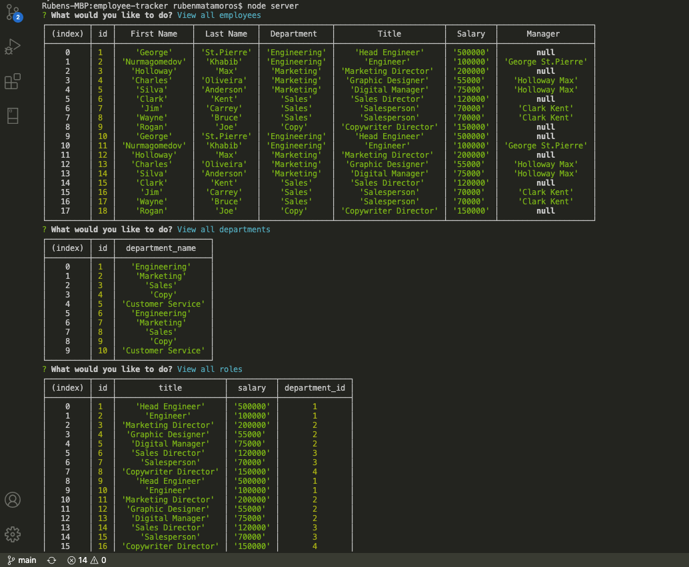

# Employee-Tracker
[](https://opensource.org/licenses/ISC) [](https://github.com/valiantcreative33/employee-tracker/issues) [](https://github.com/valiantcreative33/employee-tracker/graphs/contributors) 

## Description
Employee Tracker is a CLI application that allows the user to easily manage their business, departments, and individual employees. With Employee Tracker, you can add, remove, delete, and edit departments, roles, and employees quickly and easily. 

## Table of Contents
* [Installation](#Installation)
* [Usage](#Usage)
* [License](#License)
* [Video Demo](#VideoDemo)
* [Screenshot](#Screenshot)
* [Questions](#Questions)

## Installation
To install, you will need the following npm package dependencies: 
```
npm i mysql2
```
```
npm i inquirer
```
```
npm i console.table
```
```
npm init
```
Once done so and have cloned or forked from my repo, simply type 'npm start' to begin!

## Usage
Employee Tracker helps users maintain business data from both macro and micro views, giving the operator the ability to quickly view departmental needs and costs.

## License
This application is under the ISC license.

## Video Demo
A video demonstration of the application can be found on [YouTube](https://youtu.be/RsSERqp6LDc).

## Screenshot


## Questions
You can find me on Github: https://github.com/valiantcreative33, if you have any questions.
If you have additional questions, you can also find me on [LinkedIn](https://www.linkedin.com/in/valiantcreative/), or via email at ruben@valiantcreative.net.